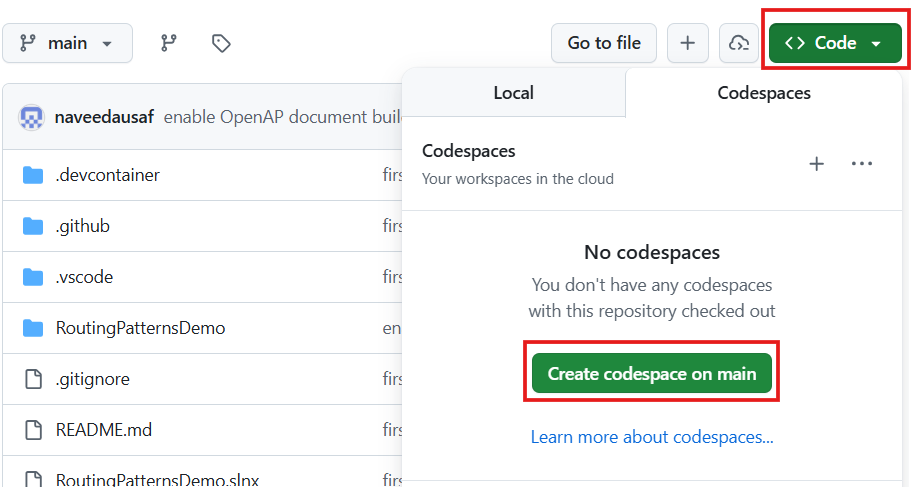
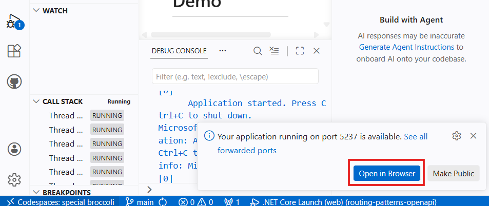
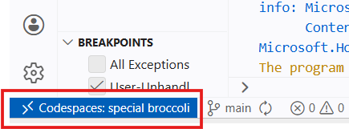
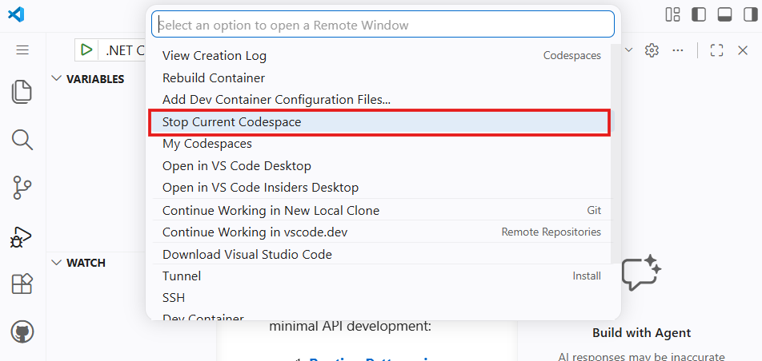
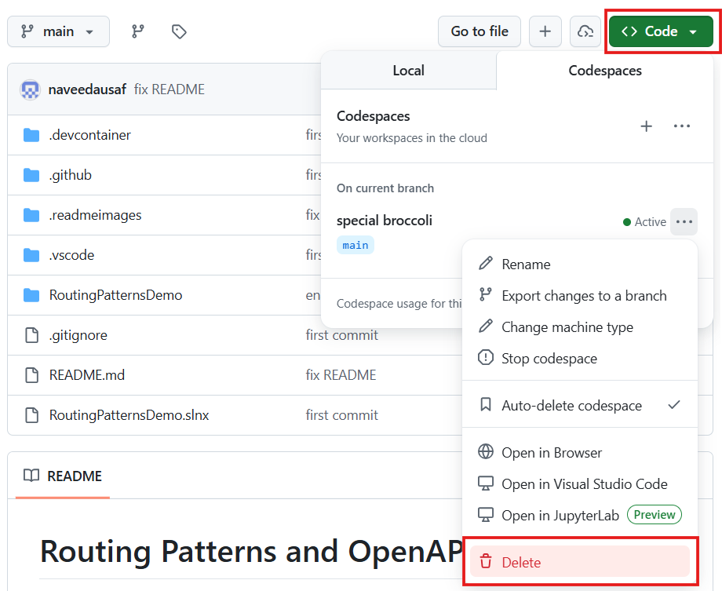

# Routing Patterns and OpenAPI Demo

A sample ASP.NET minimal API project that accompanies two articles on ASP.NET minimal API development:

1. **[Routing Patterns in ASP.NET Minimal APIs](https://dev.to/nausaf/patterns-for-routing-in-aspnet-minimal-apis-1e8c)**
2. **[OpenAPI Support in ASP.NET Minimal APIs]()** — _link to be added_

## Project Structure

```text
RoutingPatternsDemo/
├── Program.cs                          # Startup: DI registration, route mapping, OpenAPI & Scalar setup
├── Handlers/
│   └── ProductHandlers.cs              # Endpoint handlers + MapRoutesAndDescribe
├── ApplicationServices/
│   ├── CreateProductArgs.cs            # Request body record (with XML docs for OpenAPI)
│   ├── IProductService.cs
│   └── ProductService.cs               # In-memory product store
├── Domain/
│   └── Product.cs                      # Domain model (with XML docs for OpenAPI)
└── Properties/
    └── launchSettings.json
```


## Key Endpoints

| Method | Path | Description |
|--------|------|-------------|
| `POST` | `/v1/products/` | Create a new product |
| `GET` | `/v1/products/{id}` | Fetch a product by GUID |
| `GET` | `/openapi/v1.json` | Raw OpenAPI schema (JSON) |
| `GET` | `/scalar` | Interactive Scalar API browser |


## Running the Project

You can either clone and run the project locally, or run it instantly on GitHub as **a GitHub Codespace** (a cloud-based development environment that runs in your browser). 

### Locally

**Prerequisites:** [.NET 10 SDK](https://dotnet.microsoft.com/en-us/download/dotnet/10.0)

Clone the repository:

```bash
cd <suitable dir>
git clone https://github.com/naveedausaf/routing-patterns-openapi
```

To run the project:

**Either,**

```bash
cd routing-patterns-openapi/RoutingPatternsDemo
dotnet run
```
Then open `http://localhost:5237/scalar` in your browser to browse the interactive API documentation. Here you can also test the API.

**Or,** open the solution in VS Code (with the C# Dev Kit extension installed) and press **F5**. The browser will open the Scalar UI automatically.


### In GitHub Codespaces

You do not need to install anything. 

GitHub Codespaces provides a fully pre-configured cloud development environment in your browser and in local VS Code.

**Steps:**

1. On the [GitHub page for this repository](https://github.com/naveedausaf/routing-patterns-openapi), click the green **Code** button:

    

2. From the dropdown, press the **Create codespace on main** button (you may need to select the **Codespaces** tab first).
3. VS Code will open in a new browser tab. **Wait for the Codespace to build** (typically under a minute).
4. Once the Codespace has loaded, press **F5** to run the project.
5. A notification will appear asking whether to open the forwarded port in your browser — click **Open in Browser**. 
    


The Scalar UI will load.


#### Free Allowance and Cost

GitHub provides a free monthly Codespaces allowance to every account:

| Account plan | Free core-hours/month | Free storage/month |
|---|---|---|
| GitHub Free | 120 core-hours | 15 GB |
| GitHub Pro | 180 core-hours | 20 GB |

This repo's devcontainer is configured to use **2 cores**, so a GitHub Free account gets roughly **60 hours/month** of free usage on this repo.

If you exceed the free allowance, usage is billed at approximately **$0.18 per hour** for a 2-core machine (storage is billed separately at $0.07 per GB per month). [Current pricing is listed here](https://docs.github.com/en/billing/managing-billing-for-your-products/managing-billing-for-github-codespaces/about-billing-for-github-codespaces#pricing-for-paid-usage).

#### Preventing unexpected charges

To ensure you are never billed for Codespaces beyond the free tier, go to **GitHub Settings → Billing and plans → Spending limits** and set the **Codespaces** spending limit to **$0**. With a $0 limit, Codespaces will stop rather than incur charges once your free allowance is exhausted.

> **Remember to stop your Codespace** when you are done:
> 1. Click Codespaces button in the bottom left of VS Code in the browser tab:
>     
>
> 2. Then select **Stop current codespace** from the menu that drops down at the top:
>    
>
> **Better yet, delete the workspace** from **Code** button on the repo from which you launched the workspace. This would also remove storage associated with the workspace:
> 
> 1. Press **Code** button on the repo page then select the running codespace and press **Delete**:
>    


